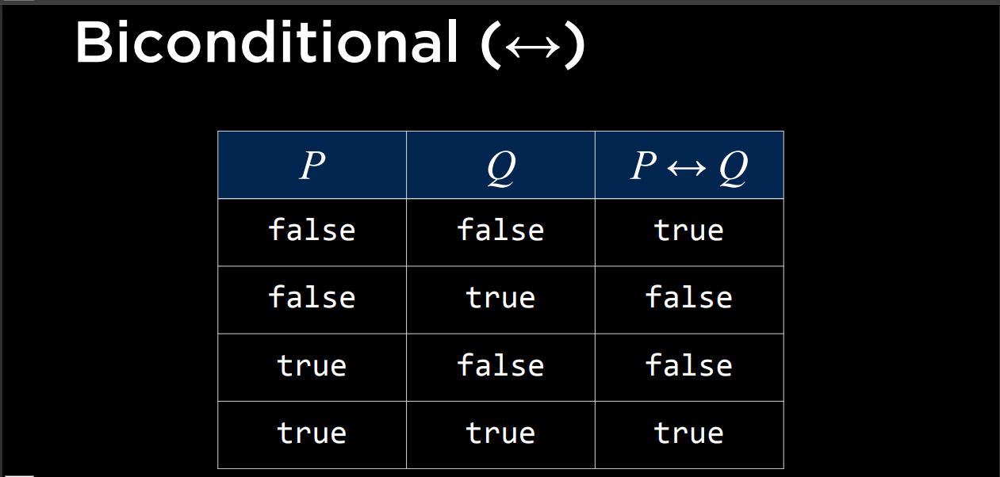

# Implication

**The only way for the result to be false is when P is true, but Q is false.**
**If P is false, there's no need to make claim to Q**

***P → Q is the same as:***
>
>if P == true, then we know that Q is true
>

# Biconditional

**In biconditional, the two logics implies to each other**

# Inference Rules

## And elimination
a ^ b
if a ^ b is true, then one of them must also be true.

## Double negation navigation
### If there are 2 negatives, remove them altogether:

It is not true that Harry did not pass the test

=

Harry did pass the test.

### i.e., ¬(¬a) == a

## Implication elimination

If it is raining, then Harry stays inside.
which means:
It is not raining or harry is inside.
Which can be represented as:
a -> b

=

¬a v b(not(a) or b)

## Biconditional elimination

It is raining if and only if Harry is inside.
##### Translated:
It is raining if Harry is inside, and if Harry is inside, then it must be raining.

## The Morgan's Law:
It is not true that both Harry and Ron passed the test.
=
Harry did not pass the test
OR
Ron did not pass the test

TRANSLATED:
¬(a ^ b)

=

¬a v ¬b

VICE VERSA(It is not true that Harry or Ron passed the test):
¬(a v b)

=

¬a ^ ¬b

***A clause is disjunction of literals***

----

# Convert implication and biconditional to **and** and **or**.

1. If both symbols imply to eachother, we can say, a implies to b and b implies to a.
2. To eliminate implications, 