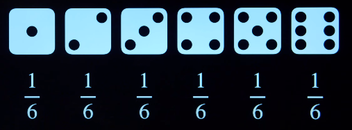
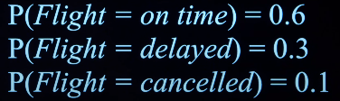
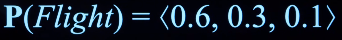
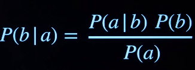
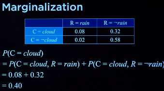
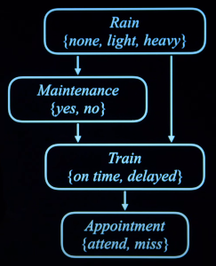
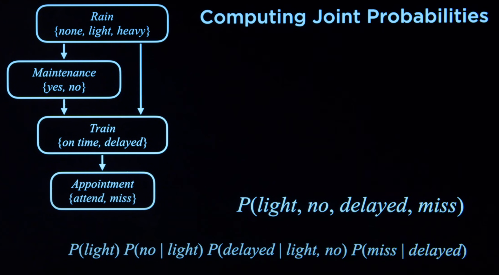

# Uncertainty
Every probability value must range from 0 and 1.
0 means impossible
1 means certain.

**Every possible situation can be thought of as a world, represented by the lowercase Greek letter omega ω**. *To represent the probability of a certain world, we write P(ω).*

For instance:
When you roll a die, the probability of getting a number is 1/6

And this is called ***UNCONDITIONAL PROBABILITY***:
Degree of belief in a proposition in the absence of any other evidence.

____
## ***CONDITINAL PROBABILITY***:
Degree of belief in a proposition given some evidence that has already been revealed.

Consider the following formula:
**P(a | b)**

The way to read this is, **THE PROBABILITY OF a GIVEN THE *EVIDENCE* b**

#### Expression:
P(a|b) = P(a ∧ b) / P(b)
:

### ***Random Variable***

a random variable in probability theory with a domain of possible values it can take on.

### ***Probability Distribution***

Can be represented in(vector):

### ***Independence***

the knowledge that one event occurs does not affect the probability of the other event.

Represent independence mathematically:

In this equation, if a and b are independent and does not have any relationship with one another, i.e. knowing a does not change the probability of b, then given a, b would not be influenced.

### Bayes' Rule

### **ATTENTION: in probability, the ∧ and comma can be used interchangeably, therefore: P(a ∧ b) is the same as P(a, b)*

## ***Probability Rules***

### ***Negation***
P(¬a) = 1 - P(a)
It means the probability of a not occuring is one minus the probability of a,
recall that the probability is just a value beween 0 and 1. So just in this 
equation, imagine the probability of a is 0, meaning it would not happen,
then, 1 - 0 is the same as 1, which means, the probability of a not happening
is 1, i.e. it would not happen.
### ***Inclusion-Exclusion***
The equation for calculating the probability of a or b is:

P(a V b) = P(a) + P(b) - P(a ∧ b)

Where P(a ∧ b) = P(a) * P(b)
P(a V b) = (1/4 + 1/13) - 1/4 * 1/13
In words:
The probability of a or b is the probability of a plus the probability of b, minus the probability of a AND b.
Consider this as a venn diagram, where the a ∧ b, is the intersection of a and b.

### ***Marginalization***
P(a) = P(a, b) + P(a, ¬b)

The equation is looking at 2 possible cases that might take place, either b is true and b is not true.
Then it would calculate the probability of a in either of the cases, if we add those together, then we get the probability of a.  

An example:

Substituting values in from a joint distribution.

### ***Conditioning***
P(a) = P(a | b)P(b)+P(a | ¬b)P(¬b)

____

## Bayesian Network
Data structure that represents the dependencies among random variables.
For instance, in this image:

Computing the picture shown above:

## Hidden Markov Models
| ***Task***      | ***Definition*** |
| ----------- | ----------- |
| Filtering      | Given observations from the start until now, calculate distribution for current state |
| Prediction   | Given observations from the start until now, calculate distribution for a future state |
| smoothing | Given observations from the start until now, calculate distribution for past state |
| most likely explanation | Given observations from the start until now, calculate most likely sequence of states |