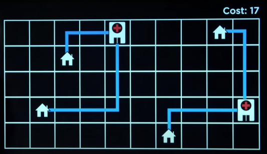

# Optimization

Optimization is choosing the best option from a set of options

-----

## Local Search
search algorithms that maintain a single node and searches by moving to a neighboring node.

It is different from search methods introduced in the first lecture(bfs, dfs, A*, greedy best) as local search is trying to figure out the optimal solution, whereas bfs, dfs, A*, greedy best are ways to figure out the path to get to the the optimal solution.

For example in the picture below, the total cost of this configuration is 17, what optimization is trying to do is find a plan that produces the lowest cost.




This is a state-space landscape, where each vertical bar is a possible state in our world, and the height of the bar is the cost of it.


If we are trying to find the maximum value along these states, we use an algorithm called ***Hill Climbing***

Start off by picking a state


And then we want to choose a state with larger value sbetween the neighbors, in this case, it is the node to the left


We repeat that process again and again


Until we reach the node where there is not place no place to `climb`


This can be written in pseudo code as:

```
function HILL_CLIMB(problem):
    current_state = problem.initial_state
    repeat:
        neighbor = current_state.highestValuedNeibour
        if neighbor is not the better than current: 
            # meaning if there's not better neighbors
            return current_state
        current_state = neighbor
```

#### Notice: there is a **local maxima** as there is a **global maximum**, a **local maxima** is when a state has all of it's neighboring values below itself, but in fact, it is not the **global maximum**, which means it is not still the highest.


And something even more annoying(flat local maximum):

'

Although we have a few other variants:

| Variant              | Definition                                   |
| -------------------- | -------------------------------------------- |
| Steepest-ascent      | choose the highest-valued neighbor           |
| Stochastic           | choose randomly from higher-valued neighbors |
| First-choice         | choose the first higher-valued neighbor      |
| Random-restart       | conduct hill climbing multiple times         |
| Local beam search    | choose the k highest-valued neighbors, meaning we are not only keeping track of one current best state, instead we are looking at k states. |

------

## Simulated annealing
You can think of this as a physical reaction in which the particles start moving really fast because the temperature is high, but as the temperature decreases, the particles slow down and eventually stop.


Early on we have a higher "temperature", meaning we are more likely too accept neighbors worse than current state.

As "temperature" decreases, we are less likely to accept worse neighbors.

### pseudo code
```py
def SIMULATED_ANNEALING(problem, max):
    current = problem.initial_state
    for t=1 to max:
        # one common implementation of the temperature function is to calculate the temperature based on the time remaining. Which is to say if the time remaining is longer, then the temperature is going to be higher.
        T = TEMPERATURE(T)
        neighbor = current.randomNeighbor
        DeltaE = how much better the neighbor is.
        if DeltaE > 0:
            # meaning it is better
            current = neighbor
            continue

        # we calculate the probability of how likely we are going to accept that node based on the deltae and `temperature`, if the neighbor is much worse than the current, we are less likely to choose it.
        with probability e**(DeltaE/T) set current to neibor
        

```

---

## Linear Programming
Goal:
Minimize a cost function c<sub>1</sub>x<sub>1</sub> + c<sub>2</sub>x<sub>2</sub> + ... + c<sub>n</sub>x<sub>n</sub>

With constraints of form a<sub>1</sub>x<sub>1</sub> + a<sub>2</sub>x<sub>2</sub> + ... + a<sub>n</sub>x<sub>n</sub> <= b(where is some bound)

or of form a<sub>1</sub>x<sub>1</sub> + a<sub>2</sub>x<sub>2</sub> + ... + a<sub>n</sub>x<sub>n</sub> = b

With bounds for each variable l<sub>i</sub>(lower bond) <= x<sub>i</sub> <= u<sub>i</sub>(upper bond)

### Example:
Two machines X<sub>1</sub> and X<sub>2</sub>. X<sub>1</sub> costs $50/hour to run, X<sub>2</sub> costs $80/hour to run. Goal is to minimize the cost.


X<sub>1</sub> requires 5 units of labor per hour. X<sub>2</sub> requires 2 units of labor per hour. Total of 20 units of labor to spend. 

X<sub>1</sub> produces 10 units of output per hour. X<sub>2</sub> produces 12 units of output per hour. Company needs 90 units of output.

#### To mathematical expressions:
<div class="comments"># x1 and x2 are how many hours to run the machine.</div>
50x<sub>1</sub> + 80x<sub>2</sub>

<div class="comments"># meaning the total number of labors spent across x<sub>1</sub> and x<sub>2</sub> is equal to or less than 20, because when have only got 20 to spend.</div>
5x<sub>1</sub> + 2x<sub>2</sub> <= 20


<div class="comments">I don't know how to explain, awkward...</div>
10x<sub>1</sub> + 12x<sub>2</sub> >= 90

### Exercise


---

## Constraints satisfication

***Unary constraint*** is a constraint involving only one variable

***Binary constraint*** is a constraint involving two variables

Node consistency is when all the values in a variable's domain satisfy the unary constraints


### Node Consistency

For example, we might have a situation where:


After enforcing ***node consistency***, we simply removed the values that do not satisfy the constraint:


Such that we satisfy the unary constraints.

### Arc Consistency

But up until now, the binary constraint A!=B is not satisfied because A and B still share the value `Wed`, so this is when ***arc consistency*** is introduced.

***Arc consistency*** is when all the values in a variable's domain satisfy the binary constraint.

To make X(some variable) arc-consistent with respect to Y, remove elements from X's domain until every choice for X has a possible choice for Y.

#### **pseudo Code**
csp = constrain satisfaction problem

```python
def REVISE(csp, X, Y):
    revised = False
    for x in X.domain:
        if no y in Y.domain satisfies constraint for (X, Y):
            del x from X.domain
            revised = True

    return revised

```
```py
def AC-3(csp):
    queue = all arcs in csp
    while queue non-empty:
        (X, Y) = DEQUEUE(queue)
        if REVISE(csp, X, Y):
            if x.domain.size == 0:
                return False
            for each Z in X.neighbors - {Y}:
                ENQUEUE(queue, (Z, X))
    return True
```

## Backtracking search
```py
def BACKTRACK(assignment, csp):
    if assignment complete:
        return assignment
    # choose a variable from the problem that has not yet been assigned
    var = SELECT-UNASSIGNED-VAR(assignment, csp)
    for value in DOMAIN-VALUES(var, assignment, csp):
        if value consistent with assignment:
            add {var = value} to assignment
            result = BACKTRACK(assignment, csp)
            if result != failure:
                return result
            remove {var = value} from assignment
    return failure
```