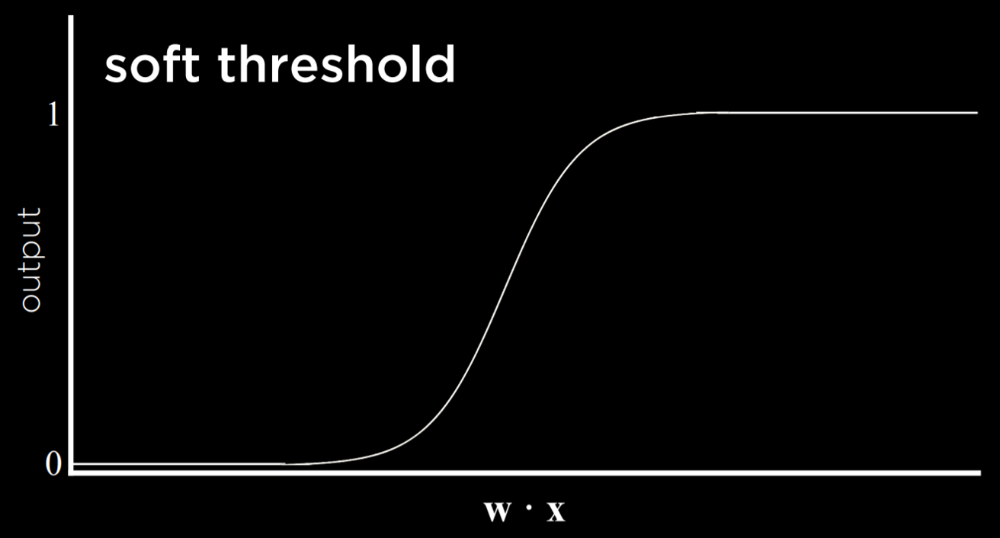

# Learning

## **Machine Learning**
Supervised learning -> given a data set of input-output pairs, learn a function to map inputs to outputs.

The tasks within supervised learning:
- Classification -> supervised learning task of learning a function mapping an input point to a discrete category. In other words, it categorizes the input into a category.
In the case of predicting the weather, we might for example have some historical data:

| Date      | Humidity  | Pressure | Rain  |
|:---------:|:---------:|:--------:|:-----:|
| January1  | 93%       | 999.7    | True  |
| January2  | 49%       | 1015.5   | False |
| January3  | 79%       | 1031.1   | False |
| January4  | 65%       | 984.9    | True  |
| January5  | 90%       | 975.2    | True  |

For example, based on the table above, we could infer:
```py
f(humidity, pressure) = Rain/No Rain

# and if we pass in a few data points form the table above
f(93, 999.7) == Rain
f(49, 1015.5) == No Rain
f(79, 1031.1) == No Rain
```
function f outputs a category based on the inputs

Then, we have a hypothesis function `h`, which takes the same parameters, but it instead estimates what function `f` does
```python
h(humidity, pressure)
```

## **Nearest-Neighbor classification**
- Judging the category of an input based on the nearest data point to it.

For example:


- If we are to judge the category of the white data point, based on the `nearest-neighbor classification` algorithm, it would be classified as blue.

- However, things get trickier when:


- If we apply the nearest neighbor algorithm, the white data point would be classified as red, but, if we look at the bigger picture, it would seem that the white dot sort of belongs to the blue side.

- This is when we should rather use **``k-nearest-neighbor classification``**, , which chooses the most common class out of k neighbors (`k` is the number of neighbors we want to look at)

## **Perceptron Learning**
- It works by trying to draw a separator, or a decision boundary between different types of observations.
- The new data point is going to be classified based on the decision boundary
- It uses a technique called **linear regression**


We need a hypothesis function to calculate and define the line:

```python
x₁ = Humidity
x₂ = Pressure


1 if w₀ + w₁x₁ + w₂x₂ ≥ 0 # where w is some weight 
0 otherwise
```

The weights and values are represented by vectors:
- Weight vector **w**: (w₀, w₁, w₂ ...)
- Input Vector **x**: (1, x₁, x₂ ...)

The vectors have the same length.

This calculation: ``w₀ + w₁x₁ + w₂x₂``, is the **dot product** of the two vectors `w` and `x`.

Programmatically:
```py
w · x = sum([w[i] * x[i] for i in range(len(x))])
```

It can also be represented as:
<code>
    h<sub>w</sub>(x) = 1 if w · x >= 0
                       else 0 
</code>

### Perceptron Learning Rule
Given data point (x, y), update each weight according to:

<code>
w<sub>i</sub> = w<sub>i</sub> + a(y - h<sub>w</sub>(x)) * x<sub>i</sub>
</code>

Which can be interpreted as:

<code>
w<sub>i</sub> = w<sub>i</sub> + a(actual value - estimate) * x<sub>i</sub>
</code>

- If we correctly predict the category of the data point, then this expression: <code>a(actual value - estimate)</code> is going to be zero. Thus the entire right hand side of the expression would be zero, so the value of <code>w<sub>i</sub></code> would not change. This is to adjust the weight such that our prediction gets closer and closer to the actual value, for example, if this expression: <code>a(actual value - estimate)</code> is a negative value, meaning our estimate is greater than the actual value, we will have to update the weight by this negative value(decreasing the weight), and vice versa with positive differences.

- In this equation, this value: <code>a()</code>, alpha, is the learning rate, it decides how much the algorithm is going to update the weight.

- The result of this process is a threshold function that switches from 0 to 1 once the estimated value crosses some threshold, and such threshold is called **hard threshold**


- One way to go around this is use **logistic regression**(previously we were using linear regression), which gives us the ability to classify data points using what's called a **soft threshold**



In this case, we are not getting only 0 and 1 anymore, but instead we get the a real number(a nonlossy version of floating point numbers, infinite precision) representing the probability of some event.

## Support Vector Machines

- The basic idea is that there are actually a lot of lines we can draw to separate the observations, for instance:


- However, the first two boundaries are problematic although they successfully separate the two groups of observations. Say, we are to analyze a new data point on the second picture for example, if that it is somewhere near the decision boundary but on the blue side, the result would be in accurate sicne the blue area covers so much more space than the red area.

- Support Vector Machines are designed to try to find the **maximum margin separator**, a boundary that maximizes the distance between any of the data points. This also works in higher dimensions, where instead of looking for a line of decision boundary, it finds the **hyperplane** that separates one set of data from another. This becomes handy when the decision boundary we are looking for is non-linear, something like:


## **Regression**
- Regression is a supervised learning task of learning a function mapping an input point to a continuous value.

For example we might have a set of data as follows:

| advertising | sales |
| ----------- | ----- |
| 1200        | 5800  |
| 2800        | 13400 |
| 1800        | 8400  |

f(1200) = 5800
f(2800) = 13400
f(1800) = 8400

## **Loss Functions**
- A function that expresses how poorly our hypothesis performs
- This function can be used to get the least lossy decision boundary.
0/1 Loss function
```py
L(actual, predicted):
    0 if actual = predicted
    1 otherwise
```


In this model, four of the data points are different from the actuality, so the total lost is 4.

### L1 Loss function
- Gets the distance between the actual data point and the predicted.
- Can be used to get the optimal decision boundary by calculating a line where the sum of distances between itself and each of the data points has the minimum possible value.
```py
L(actual, predicted) = abs(actual - predicted)
```


### L2 Loss function
- More harshly panelized the outliers
- Worse data points can be easily visualizes
```python
L(actual, predicted) = (actual - predicted) ** 2
```

## Overfitting
- Overfitting is when a model fits the training data so well that it fails to generalize to other data sets. In this sense, loss functions are a double edged sword. In the two examples below, the loss function is minimized such that the loss is equal to 0. However, it is unlikely that it will fit new data well.


So to try to avoid overfitting, we will define our cost as follows, **where h is the hypothesis function that draws the decision boundary**:
```py
cost(h) = loss(h) + λcomplexity(h)
```
And the symbol `λ`(pronounced Lambda), is some parameter that affects the overall cost of the hypothesis function `h`. If `λ` is greater, that means we want to penalize more complex models, otherwise if it is smaller, we would like to penalize complex models a **little bit**

## **Regularization**
- Penalizing hypotheses that are more complex to favor simpler, more general hypotheses

### Holdout Cross Validation
- With holdout cross validation, we can test whether our model is overfitted.
- Splitting data into a training set and a testing set, such that learning happens on the training set and is evaluated on the test set
- The machine learns via the training set, and tests how well it performs via the test set.

### k-fold Cross-Validation
- splitting data into `k` sets, and experimenting k times, using each set as a test set once, and using remaining data as training set. The process can be expressed in pseudo code as follows:

```python
# the number of data sets
K = 10
# an array of all datasets
datasets = [d0, d1, d2, ..., d9]

# setting up a list to record the scores
scores = []

# iterating over the datasets
for i in range(K):
    # pick one dataset according to the value of i
    testSet = datasets[i]
    
    # get a list of training sets excluding the test set
    trainingSets = datasets[:]
    trainingSets.remove(testSet)
    
    for tnSet in trainingSets:
        # train the machine with every single one of the training sets
        machine.train(tnSet) 
    # test it and we get a score
    score = machine.test(testSet)
    # then append it to the scores
    scores.append(score)

# finally we get the average score
average = sum(scores) / K
```

## **Reinforcement learning**
- Given a set of rewards or punishments, learn actions to take in the future


The AI agent starts at some state, it then takes an action, which would result in moving onto another state but also, it gets a response that tells it whether the action was good, such that I learns what to do and what not to do.

## **Markov Decision Processes**
- Model for decision-making, representing states, actions, and their rewards.
This process has the following properties:
    - Set of states S
    - Set of actions Actions(S)
    - Transition model P(s’ | s, a)
    - Reward function R(s, a, s’)
For example in this maze: 


Without informing the AI about the red/green blocks(where they get a punishment or a reward), the AI can try to explore the blocks and learn from them, say, it encountered a red block and got a punishment, it would remember that whenever it is at that particular state, do not move onto the block where it got punished, and the same logic with the green blocks. It would remember the good nodes(the ones that are gray) as well.

## **Q-Learning**
- Method for learning a function `Q(s, a)`, estimate of the value of performing action `a` in state `s`

Steps:
```
Start with Q(s, a) = 0 for all s, a
When we take an action and receive a reward:
    Estimate the value of Q(s, a) based on current reward and expected future rewards
    Update Q(s, a) to take into an account old estimate as well as out new estimate
    
``` 

Formalized:
```python
Start with Q(s, a) = 0 for all s, a
When we take an action and receive a reward:
    # r is the reward value.
    Q(s, a) = Q(s, a) + a(new value estimate - old value estimate) 
    Formalized to:
    Q(s, a) = Q(s, a) + a((r + future reward estimate) - Q(s, a))
    Formalized to:
    Q(s, a) = Q(s, a) + a((r + future reward estimate) - Q(s, a))
    # the future reward estimate means the action 
    # across all possible actions that 
    # can get the maximum value of reward. 
    Formalized to:
    Q(s, a) = Q(s, a) + a((r + y maxₐ Q(s', a')) - Q(s, a))
```

### Explore vs. Exploit
- If a AI only ever exploits information(using past information that leads it to the target), might be able to get reward, but might not try to figure out a more optimal solution(faster, easier, shorter pach, etc)
- To implement the concept of exploration and exploitation, we can use the ε (epsilon) greedy algorithm. In this type of algorithm, we set ε equal to how often we want to move randomly. With probability 1-ε, the algorithm chooses the best move (exploitation). With probability ε, the algorithm chooses a random move (exploration).

## **Unsupervised learning**
- Given input data without any additional feedback, learn patterns.

### Clustering
- Organizing a set of objects into groups in such a way that similar objects tendo to be in the same group.

***Applications:***
- Genetic research
- Image segmentation
- Market search
- Medical imaging
- Social network analysis


## k-means clustering
- algorithm for clustering data based on repeatedly assigning points to clusters and updating those clusters' centers.

- It maps all data points in a space, and then randomly places k cluster centers in the space (it is up to the programmer to decide how many; this is the starting state we see on the left). Each cluster center is simply a point in the space.
- Then, each cluster gets assigned all the points that are closest to its center than to any other center (this is the middle picture).
- Then, in an iterative process, the cluster center moves to the middle of all these points (the state on the right), and then points are reassigned again to the clusters whose centers are now closest to them. 
- When, after repeating the process, each point remains in the same cluster it was before, we have reached an equilibrium and the algorithm is over, leaving us with points divided between clusters.


