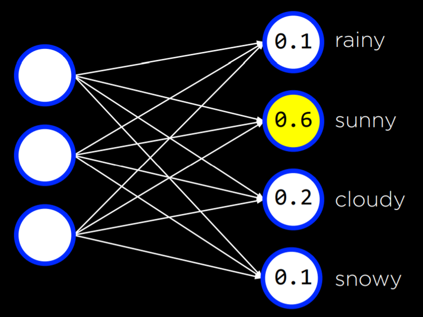
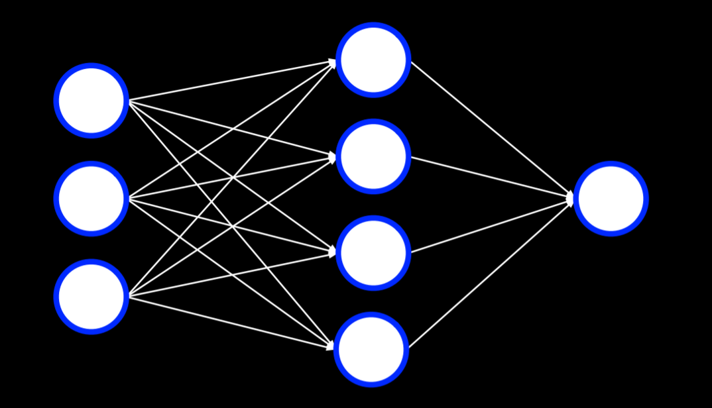

# Neural Networks

- Neurons are connected to and receive electrical signals from other neuton
- Neurons process input signals and can ba activated

### Artificial neural network
Mathematical model for learning inspired by biological neural networks
- Model mathematical function from inputs to outputs based on the structure and parameters of the network.
- Allows for learning the network's parameters based on data.
- The idea of neurons are represented as **nodes** in a graph, where they can connect to each other by an **edge**.

In this equation:

```python
h(x1, x2) = w0 + w1x1 + w2x2
```

The w0 can be considered to be multiplied by one, but it's also reasonable to call it a **bias**.

## Activation functions
An activation function that determines when it is that this output becomes active, changes to another classification.
 
- Step function - a binary classification which gives 0 before a certain threshold is reached and 1 after the threshold is reached. 

    `g(x) = 1 if x >= 0; else 0`

    

- Logistic function - where rather than giving a certain value(0 or 1), there is some probability, and the result might be a real number. 

    `g(x) = (e^x)/(e^x + 1)`

    

- Rectified linear unit(ReLU) - it works by taking the maximum between the input and 0. So if it's positive, it remains unchanged, but if it's negative, it goes ahead and levels out at 0.

    

## **Neural Network Structure**
The idea of hypothesis functions can be represented as follows:


The two nodes on the left are inputs, x1 and x2, and they are both connected to the output(node on the right), via the edge between the nodes, which in this case is defined as the weight. Finally a bias `w0` is going to be passed in to a activation function, which then gets a result.

For example, the picture below is the truth table for the OR operator:


They are connected to the output unit by an edge with a weight of 1. The output unit then uses function g(-1 + 1x₁ + 1x₂) with a threshold of 0 to output either 0 or 1 (false or true).

This can be represented using a neural network. x₁ and x₂ are the inputs, they are connected to the result node by an edge with a weight of 1(that means they are going to be multiplied by the weight, which is 1). The output node then uses adds a bias, which in this case is -1 to the activation function to calculate the final result.

Of course we could have more than two inputs there(in fact as many as we want). We might have something like this:


Thus we get the formula for computing this particular output is:


Computationally representing the formula(assuming we have n nodes connected to the output):
```py
sum([xᵢ * wᵢ for i in range(n)]) + w0 # w0 is the bias
```

## **Gradient Descent**
Algorithm for minimizing loss when training neural network.

- ``Start with a random choice of weights``
- ``Repeat``:
    - <code>Calculate the gradient based on <b>all data points</b> that will lead to decreasing loss. Ultimately, the gradient is a vector (a sequence of numbers).</code>
    - ``Update weights according to the gradient``


But the expensive part of this algorithm is <code><b>all data points</b></code>, where we have to look at all of the data points. But there are alternatives to the standard gradient descent.

Not only can we add nodes to the input layer, instead of just one output, you might also add nodes to the output layer and connect the new nodes with all of the inputs. 

For example, in the case of predicting the weather, we might not only want to predict whether it is going to rain or not, we might also be interested in what exactly the weather is(snowy, cloudy, smoggy, ...).



In this picture, the input nodes on the right might be some data collected about the weather, each of the inputs gets multiplied by a weight, and finally results in some probability. We then can choose the output node with the highest probability and say we would like to categorize the data to that class.

When training a neural network that has multiple outputs, we could treat them as several individual neural networks.


### ***Stochastic Gradient Descent***
Pretty similar to the standard algorithm, but instead we are looking at one random data point instead of all data points. Although this tends to be a lot faster, but the result might not be as accurate.

- ``Start with a random choice of weights``
- ``Repeat``:
    - <code>Calculate the gradient based on <b>one random data point</b> that will lead to decreasing loss. Ultimately, the gradient is a vector (a sequence of numbers).</code>
    - ``Update weights according to the gradient``

### ***Mini-Batch Gradient Descent***
Pretty similar to the standard algorithm as well, but this time we are looking at a small batch(a small group) of data points, and the number of data points in the batch is up to the programmer. In conclusion, this is somewhere between the two algorithms introduced before, it is not the fastest, nor the most accurate, but it balances the tradeoff.

- ``Start with a random choice of weights``
- ``Repeat``:
    - <code>Calculate the gradient based on <b>one small batch</b> that will lead to decreasing loss. Ultimately, the gradient is a vector (a sequence of numbers).</code>
    - ``Update weights according to the gradient``


## **Multilayer Neural Networks**
Artificial neural network with an input layer, an output layer, and at least one hidden layer.

For example:



The four nodes in the input layer aren't directly connected to the output node, but instead they are connected to a <code>*"hidden layer"*</code>, which in this case consists of four nodes, then then hidden layer is going to go through some activation function and finally results in an output.

This is useful when computing functions that are used to draw more complex decision boundaries(non-linear for example). Through hidden layers, it is possible to model non-linear data.

## **Backpropagation**
Algorithm for training neural networks with hidden layers

Pseudo code:

```
Start with a random choice of weights
Repeat the training process again and again:
    calculate error for output layer
    For each layer, starting with output layer, and moving inwards towards earliest hidden layer:
        Propagate error back one layer
        Update weights
```

This can be extended to any number of hidden layers, creating deep neural networks, which are neural networks that have more than one hidden layer.


## **Overfitting**
- Overfitting is a potential danger caused by fitting too closely to the training data, thus it fails to generalize to other situations(when dealing with data other than the training data). This happens as we begint over-rely on certain nodes inside the neural network.  
- 

### *Dropout*
Dropout is a technique used when dealing with overfitting. The goal is to prevent over-reliance on certain units.
- temporarily removing units - selected at random - from a neural network to prevent over-reliance on certain units
- Each time we train the model, we randomly remove some nodes from the neural network, so that we don't heavily rely on any one particular node.


## **TensorFlow**
taking advantage of existing libraries, we can simulate the process of training a neural network.

This is an example in python:

```python
# Create a neural network
model = tf.keras.models.Sequential()

# Add a hidden layer with 8 units, with ReLU activation
model.add(tf.keras.layers.Dense(8, input_shape=(4,), activation="relu"))

# Add output layer with 1 unit, with sigmoid activation
model.add(tf.keras.layers.Dense(1, activation="sigmoid"))

# Train neural network
model.compile(
    optimizer="adam",
    loss="binary_crossentropy",
    metrics=["accuracy"]
)
model.fit(X_training, y_training, epochs=20)

# Evaluate how well model performs
model.evaluate(X_testing, y_testing, verbose=2)

```


