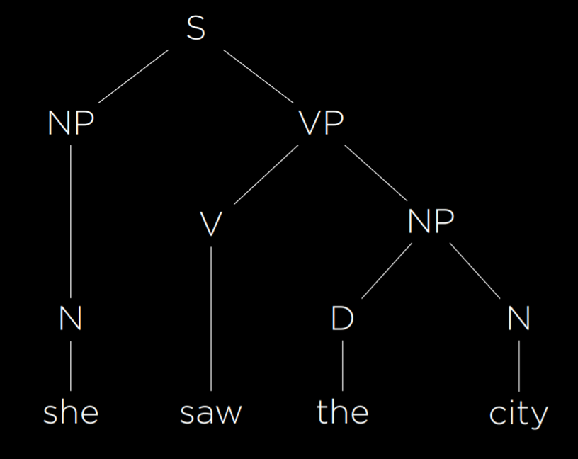
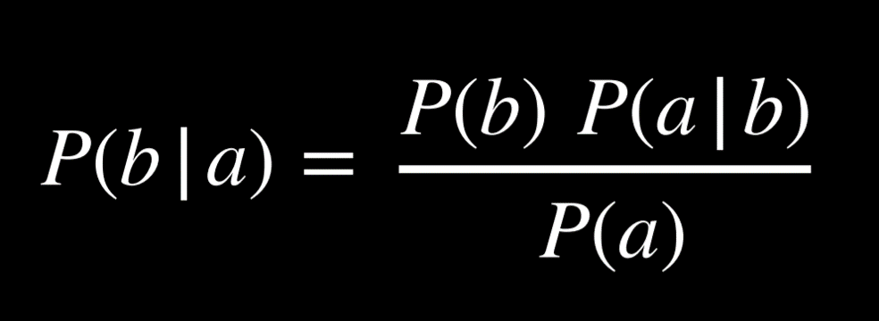
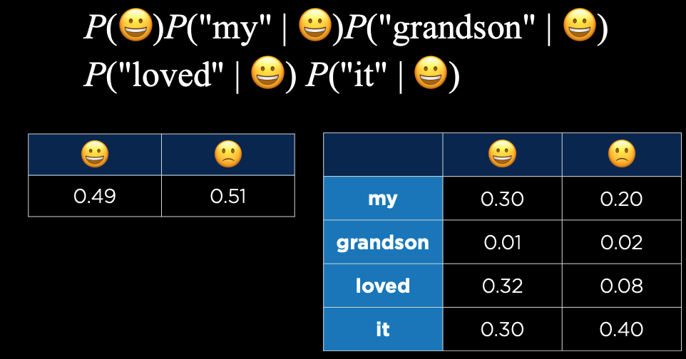
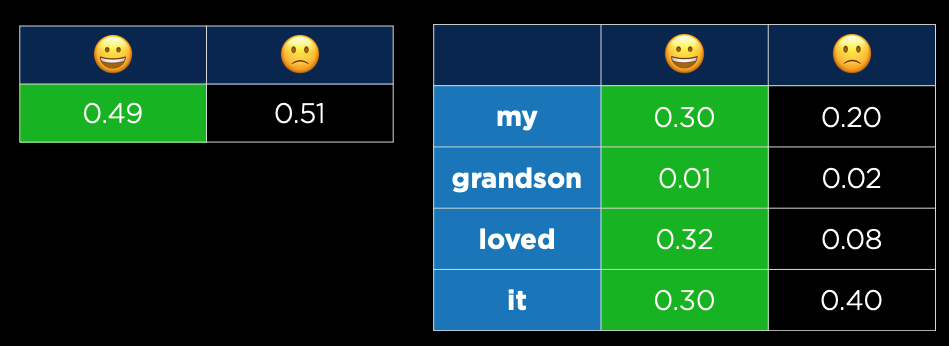
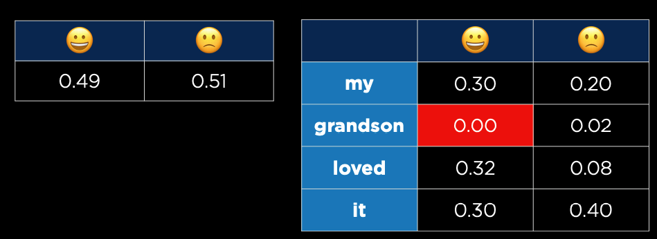

# Language

some common tasks using Natural Language Processing:
- automatic summarization
- information extraction
- language identification
- machine translation
- named entity recognition
- speech recognition
- text classification
- word sense disambiguation , where the AI needs to choose the right meaning of a word that has multiple meanings (e.g. bank means both a financial institution and the ground on the sides of a river).

## **Syntax and Semantics**
**Syntax** is the structure of a sentence, where different parts of the sentence somehow together construct a grammatically well formed sentence.

**Semantics** is the meaning of words in a sentence. While the sentence “Just before nine o’clock Sherlock Holmes stepped briskly into the room” is syntactically different from “Sherlock Holmes stepped briskly into the room just before nine o’clock,” their content is effectively identical, so their overall meaning is the same but the structures are different. 
Some phrases might be entirely syntactically correct, but are completely nonsensical. For instance, the sentence: `Colorless green ideas sleep furiously`.

## **Context-Free Grammar**

### ***Formal grammar***
A system of rules for generating sentences in a language

Consider this simple, valid, and well formed sentence:

```py
she        saw        the        city
```
The words shown above are **terminal symbols**, those are what we ultimately care about generating. But each of the words is going to be associated with a **non-terminal symbol**(we use non-terminal symbols to get terminal symbols), for example, the simple sentence above might be translated to:

```py
N(oun)    V(erb)   D(eterminer)    N(oun)
she        saw        the           city
```

### ***Rewriting rules***
```py
P == Preposition
NP = noun phrase
VP = verb phrase
S = sentence

N -> she | Ken | car | city | ... 
D -> the | a | an | those | ... 
V -> saw | ate | procrastinate | talk | ... 
P -> to | over | below | on | ... 
ADJ -> relevant | dumb | charming | old | ... 

# advanced ones
NP -> N | DN
VP -> V | V NP
S -> NP VP
AP -> A | A AP
PP -> P | NP
```

An example of noun phrase:
```python
        NP
        ʌ
       / \
      D   N
      |   |
     the city
```

An example of verb phrase:
```python
        NP
      /    \
     /      \
    V       NP
    |       /\
   saw     /  \
         the  city
```

In our case, she saw the city would be:



A more complex example containing adjective and prepositional phrases:

```bash
         S                      
  _______|___                    
 |           VP                 
 |    _______|____               
 |   |            NP            
 |   |    ________|___           
 |   |   |            NP        
 |   |   |         ___|_____     
 |   |   |        AP        |   
 |   |   |    ____|___      |    
 NP  |   |   |        AP    NP  
 |   |   |   |        |     |    
 N   V   D   A        A     N   
 |   |   |   |        |     |    
she saw the blue     wide street
```

## **n-grams**
a contiguous sequence of *n* items from a sample of text

### ***character n-gram***
a contiguous sequence of *n* characters from a sample of text

### ***word n-gram***
a contiguous sequence of *n* words from a sample of text

### ***Unigram***
A contiguous sequence of 1 item from a sample text

### ***Bigram***
A contiguous sequence of 2 item from a sample text

### ***Trigram***
A contiguous sequence of 3 item from a sample text

In this sentence:

“How often have I said to you that when you have eliminated the impossible whatever remains, however improbable, must be the truth?

The first three trigrams are ***How often have***, ***often have I***, and ***have I said***.

## **Tokenization**
The task of splitting a sequence of characters into pieces(tokens)

# **Markov Models**

As discussed in previous lectures, Markov models consist of nodes, the value of each of which has a probability distribution based on a finite number of previous nodes. Markov models can be used to generate text. To do so, we train the model on a text, and then establish probabilities for every n-th token in an n-gram based on the n words preceding it. For example, using trigrams, after the Markov model has two words, it can choose a third one from a probability distribution based on the first two. Then, it can choose a fourth word from a probability distribution based on the second and third words. To see an implementation of such a model using `nltk`, refer to generator.py in the source code, where our model learns to generate Shakespeare-sounding sentences. Eventually, using Markov models, we are able to generate text that is often grammatical and sounding superficially similar to human language output. However, these sentences lack actual meaning and purpose.

## **Text categorization & Bag-of-Words Model**
- Bag-of-words is a model that represents text as an unordered collection of words.
- This model ignores syntax and considers only the meanings of the words in the sentence.
- This approach is helpful in some classification tasks, such as sentiment analysis (another classification task would be distinguishing regular email from spam email). 
- Sentiment analysis can be used, for instance, in product reviews, categorizing reviews as positive or negative.

Consider the following reviews on some product:

- “My grandson loved it! So much fun!”
- “Product broke after a few days.”
- “One of the best games I’ve played in a long time.”
- “Kind of cheap and flimsy, not worth it.”

As a human, we know that two of the sentences are positive and the others are negative because of the words that show up in the text(fun, loved, best & broke cheap, flimsy).

## **Naive Bayes**
Naive Bayes is a very popular technique often used in sentiment analysis of Bag-of-Words models. It is based on the Bayes rule of probability:



In the case of analyzing the reviews, we would like to calculate the probability of negative and probability of positive.

For example, say, we are trying to figure out the probability that the first review shown above is positive(represented using the emoji)
```py
P(😀 | "my", "grandson", "loved", "it") # the probability that this is a positive message

naively proportional to

P(😀 )P("my" | 😀 )P("grandson" | 😀 )P("loved" | 😀 )P("it" | 😀 )
```

Calculations that can be achieved based on some given data to work out the probability distribution stated above:
```python
# the probability that a message is positive
P(😀 ) = number of positive samples / number of total samples

P("loved" | 😀 ) = number of positive samples with "loved" / number of positive samples
```

Given the following set of data, how can we calculate the probability that the sentence “My grandson loved it! So much fun!” is a positive message?



We could simply multiply the probabilities highlighted in green:



which results in:

```
    P(😀 )P("my" | 😀 )P("grandson" | 😀 )P("loved" | 😀 )P("it" | 😀 )
                                    =
                        0.49 * 0.3 * 0.01 * 0.32 * 0.3
                                    =
                                0.00014112
```

However this number alone isn't meaningful, but if we get the **probability that this particular sentences is a negative message**:

```
    P(🙁 )P("my" | 🙁 )P("grandson" | 🙁 )P("loved" | 🙁 )P("it" | 🙁 )
                                    =
                        0.51 * 0.2 * 0.02 * 0.08 * 0.40
                                    =
                                0.00006528
```

and **normalize these two values**(adding them up and divide each of them by the sum):
```
0.00014112 / (0.00014112 + 0.00006528)
0.00006528 / (0.00014112 + 0.00006528)
```

and the result(rounded to 4dp) would be:

```python
# we are 68% confident that this is a positive message
0.6837
0.3163
```

But there is a challenge we have to deal with, imagine the word grandson has never appeared and been recorded into the dataset, now the join probability of P("grandson" | 😀 ) would be 0, which would ultimately end up ignoring all of the other possibilities since any number that gets multiplied by 0 would always be 0.



This can be avoided by using **additive smoothing**, which is a technique that adds a value _a_ to each value in our distribution to smooth the data, such that no probability has a value of 0. One such approach is called **Laplace smoothing**, which adds 1 to each value in our distribution: pretending we've seen each value on more time than we actually have.

## **Information retrieval**
The task of finding relevant documents in response to a user query, something like a search engine would do.

### ***term frequency***
number of times a term appears in a document, this can be used to extract some important information about a document. The words that appear more frequently are likely to be important.

## **tf-idf**
ranking of what words are important in a document by multiplying term frequency(tf) by inverse document frequency(idf)

### **Function words**
A fixed list of words where each word is used to connect other grammatical structures(to, do, am, which, with, yet, is)

### **Content words**
Words that carry meaning independently(e.g., computer, data, algorithm...)
When looking for words with top frequency, we ultimately care about ranking the content words.

### **Inverse document frequency**
Measure of how common or rare a word is across documents.

```py
math.log(TotalDocuments / NumDocumentsContaining(word))
```

## **Information extraction**
The task of extracting knowledge from documents

It might be useful to provide the ai some template in order to extract information. Consider the following parts of articles:

"When Facebook was founded in 2004, it began with a seemingly innocuous mission"...

"Remember, back when Amazon was founded in 1994, most people"...

There is a common pattern, which can be represented as a template, in this case, it will be: 
```py
f"When {company} was founded in {year},"
```

An AI could also be trained to form templates itself, for example, given two pieces of information, company and year, it would search through the internet where those two pieces of information show up together. You might imagine the AI is going through an article where it explores a sentence "Facebook is a company founded in 2004. ...", and given that the company *facebook* is founded in the year *2004*, it could learn the template: 
```py
f"{company} is a company founded in {year}."
```

## **Word representation**
